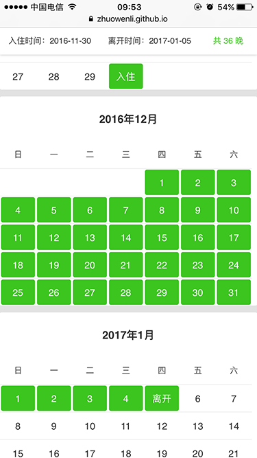

# jQuery Calendar

参考Airbnb客户端的日期选择功能，实现基于jQuery的多日期选择插件。

在线预览：[https://zhuowenli.github.io/jquery-calendar/](https://zhuowenli.github.io/jquery-calendar/)



## Usage

```html
<div id="calendar-box" class="calendar"></div>
```

```js
$('#calendar-box').calendar({
    checkIn : null, // Date, 开始时间
    checkOut: null, // Date, 结束时间
    totalMohth: 12, // Number, 可选月份长度
    dayText: ['入住', '离开'], // Array, 选中标识
    checkDayChange: function(){
        // callback
    }
});
```